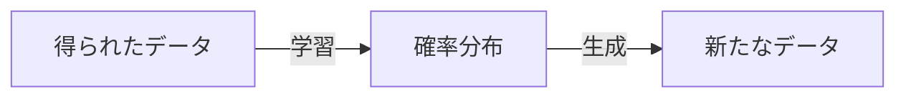

---
type: 'blog post'
title: 'Understanding Generative Model for Everyone: Chapter 0'
date: '2026-03-25'
tags: ['research']
abstract: 'Write a short summary of this post.'
thumbnail: '/posts/thumbnail.webp'
---

# 触って理解する生成モデル

# はじめに

非常に高精細な画像や動画を生成したり、高度な思考・推論ができるLLM、リアルな会話ができる音声合成や、化学物質の構造を生成したりする、いわゆる「生成AI」の進化は、ここ数年で加速度的に進化し、何十年も前に夢見たSFの世界にほぼ到達し、常に目を見張るものがあります。しかし、これら生成AIの原理や仕組みを理解している人は、生成AIの開発や業務に関わっている人ですら、多くはいないと思われます。生成モデルの背景には、一体どのような理論や計算があり、どのように学習され、どのように生成をしているのでしょうか？

**この記事では、一見、理解するためには高度な専門知識が必要と思われる「生成モデル」の原理を、できるだけ多くの人にわかりやすく伝えることを目的として、「触って理解できる」ような工夫を盛り込みながら解説します**。数字や数式を扱いやすく見るために、マウスやスマートフォンのタッチ操作で触ることのできるウィジェットを通して、生成モデルの原理を伝える試みです。

想定している読者は、高等学校や大学の１〜２年生で、確率・統計や、微分・積分のごく基本的な計算や、正規分布についてすでに学んだ人を対象にしますが、この記事のウィジェットのみを触ってでも理解ができるよう、事前知識ができるだけ必要ないように心がけています。

本記事の構成は以下の通りです。
TODO

人類史上、最も大きな発明の一つになりうる生成AIの背景にある原理や計算手法が、より多くの人に理解され、みなさんが生成AIを使う上での大事な知識となっていることを願っています。

# 序章

本格的に生成モデルの話をする前に、サイコロで遊んだり、実際のデータなどを使って、確率分布について学んでみましょう。本章で「確率分布」や、「確率変数」という言葉の意味を理解することができれば、もう生成モデル習得の準備ができています。

## サイコロの確率分布

ここに、サイコロがあります。転がすと、１から６までの数のどれかがランダムで現れます。

では、このサイコロの**確率分布**はどうなっているでしょうか？・・・難しそうな言葉ですね。でも、まずは専門用語を忘れて、こんな問題を考えてみましょう。
**このサイコロを６００個同時に振ったとして、１から６の目は、それぞれ何回ずつ出るだろうと思われますか？**

<aside>
❔

サイコロを６００個ふったとき、１の目から６の目までがそれぞれ何度現れるだろうと思われますか？

</aside>

おそらく、多くの方は「各目がそれぞれ、だいたい１００回ずつ出る」と答えるでしょう。そのとおり、正解です。なぜなら、サイコロは面が６つあり、それぞれの面が等しく、均等に現れるとするなら、600÷6 = 100回ずつでる、と考えられるからです。つまり、「各目は1/6の確率で出る」ということですね。

もちろん、サイコロの出る目はランダムで、実際に試してみてそれぞれぴったり100回ずつあらわれるのではなく、「大体100回ずつぐらいになる」というのが正しいです。

では、この「各目が1/6の確率で出る」を、図にしてみましょう。以下にウィジェットを貼ります。サイコロを振るシミュレーションができるので、数を変えたりして試してみてください。

<widget type="dice-roll" title="サイコロの確率分布" rolls="600" probabilities="1,1,1,1,1,1" />

この水色のグラフが「確率分布」です。それぞれの目（確率変数）に対して、その確率がどれだけかを対応させたものです。サイコロのように全ての目に同じ確率1/6が割り当てられた分布を、特に**一様分布**といいます。

$$
サイコロの確率分布: p(x) = 1/6 \\
x \in \{1, 2, 3, 4, 5, 6\}
$$

## イカサマサイコロの確率分布

さて、このサイコロを見てください。このサイコロを転がすと、１から６までの数のどれかが現れます。先ほどと同じようなウィジェットを用意しましたので、このサイコロを降ってみてください。

<widget type="dice-roll" title="イカサマサイコロの確率分布" rolls="600" probabilities="0.13,0.13,0.13,0.13,0.15,0.33" />

このサイコロを振ってみた方はお気づきかもしれません。これはイカサマサイコロです。6の目に偏って出てくる、特殊なサイコロです。

これはイカサマサイコロなので、先程のまともなサイコロと同じ、フラットな確率分布をしていないと思われます。
このイカサマサイコロを定義している確率分布を当ててみましょう。

もちろん、600回振って、それぞれの目が何回ずつ出たかをもとに、それぞれの確率を推定するというので大丈夫です。
ただしここでは、生成モデルの概念を理解するために、すこし工夫をしてみます。

このイカサマサイコロをN回振ったときに、そのN個のデータをもとに、今現在考えている確率分布が、そのN個のデータとどれだけ対応しているかの「マッチ度」を計算してくれる、不思議なゲージを用意します。
難しい式ではないので安心してください。今はまず、「こういう指標があるんだな」とだけ思っておいてください。

$$
マッチ度 : L( \mathcal{D})
$$

このように、マッチ度をL、観測されたデータをDとします。このマッチ度がどのように計算されるかは、次の章ですぐ説明します。
ただし、今はこのマッチ度のゲージがあって、それを高くするように確率分布を求めると、それはデータとよく対応が取れている、というスコアのようなものだと思ってください。

それでは、以下のウィジェットを見てください。ここでは、確率分布を弄ることができるように、各目のp(x)をスライダーで調節できるようにしています。このスライダーの6の目のぶぶんを少しずつ、「マッチ度」が高くなるように調節して、イカサマサイコロから観測されたデータDと、対応が良くなるように調節してみてください。このゲージが青色になったらだいたい合格です。実際に観測された数と見比べてみながら調節してみましょう。

<widget type="dice-match" title="分布マッチゲーム" rolls="600" hidden="0.13,0.13,0.13,0.13,0.15,0.33" />

もし、「6が出る確率がだいたい1/3になっていて、それ以外は一定」という偏った確率分布になっていたらビンゴです！
そのようなイカサマサイコロを用意しました。大事なのは、あなたが **「観測されたデータDに基づいて、マッチ度L(D)ゲージを使い、もとの確率分布の形を推定した」** ということです。

この確率分布の形を求める作業そのものが、生成AIがデータを学習して、そのデータに基づいて新しいデータを産み出す作業の本質です！今、初めてのデータ生成モデルを作ったんですよ（笑）

今は、サイコロの目という、1次元上に6種類の値があるだけのシンプルなものですが、画像や動画などのもっと複雑なデータについても、「**観測されたデータDに基づいて、マッチ度L(D)ゲージを使い、もとの確率分布の形を推定」**できれば、その確率分布から再度データを生成し、高精度な画像や動画を生成する、ということができるようになるわけです。

## 連続データ：身長の確率密度分布

次に、同じような「確率分布マッチゲーム」を、連続値のデータについてやってみましょう。

身長は、さいころのように飛び飛びの値(1,2,3…)ではなく、連続値（162.3, 180.2 …)を取ります。なので、確率分布自体も連続の関数です。

以下のウィジェットを見てください。グラフには、観測された、ある地域の男性の身長データがあります。このデータに最も合う確率分布関数を探してみましょう。プルダウンメニューから、一般的に統計学で用いられる様々な分布があるので、試してみてください。パラメータを操作して、マッチ度が大きくなるような分布とパラメータの組み合わせを見つけられますか？

<widget type="height-fit" title="身長データの分布フィット" />

先ほどと同じように、データDから、それによく適合している確率分布が、だいたい正規分布に従っていることがわかったと思います。その確率分布から、新しくデータをサンプリングすれば、その地域の身長の男性を新しく作り出す、ということが出来ます。

いま、ここで「身長を一つ生成する」というのが、生成AIによる画像生成と関連付けがしづらいと思う方も多いと思いますが、今扱っているのは1次元のデータで、画像は数万次元という途方もなく広大な空間上のデータです。その話は追ってしますが、本質的には同じことですので、まずはこの「小さな生成」を足がかりにしましょう。

## まとめ

この章では、確率分布について、サイコロや身長のデータを使って学んできました。

**確率分布**とは、ある値（確率変数）が確率を伴って現れるとき、その値と確率の対応関係を表したものです。サイコロのように、すべての値に同じ確率が割り当てられた分布を**一様分布**、身長のように連続した値が釣り鐘型の形をした分布を**正規分布**といいます。

そして、この章で最も大事だったのは、「マッチ度ゲーム」を通して体験したことです。

> **観測されたデータDに基づいて、マッチ度L(D)を最大にするような確率分布を求める**
> 

これが、生成モデルの学習の本質です。サイコロの目であれ、身長であれ、やっていることはまったく同じです。生成モデルの学習においては、この章で取り上げた、サイコロや身長の確率分布マッチゲームのイメージは、今後ずっとついてきますので、わからなくなったらいつでも戻ってきてください。

１章では、このマッチ度L(D)が具体的にどのような式で計算されるのかを見ていきます。
